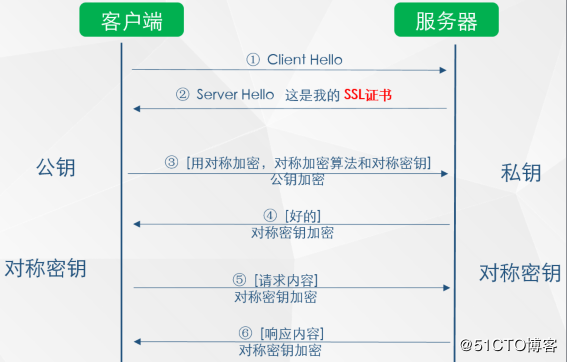

# Https原理和CA证书申请

Web服务器存在http和https两种通信方式，http默认采用80作为通讯端口（不加密的方式进行传输），https默认采用443端口，对于传输的数据进行加密传输

本文主要内容包括https加密传输的原理、如何申请https所用的CA证书，如何配置web服务支持https。

## https原理通俗讲解

https = http + ssl，顾名思义，https是在http的基础上加上了SSL保护壳，信息的加密过程就是在ssl中完成的。

在通讯过程中，一旦以明文的方式进行传输，这个信息是完全暴露到互联网上面的，请求的所有信息都可以被窥视到，而这还不是最关键的问题，http的传输最大的隐患是信息劫持和篡改。

https采用的是TLS加密，如果没有密钥是无法解析传输的是什么信息的。

## 加密方式

加密传输存在对称加密和非对称加密

### 对称加密

对称加密是客户端A在传输前使用加密算法（密钥）进行加密，客户端B收到后使用同样的密钥进行解密。大多数情况下，这等于没有加密，因此不为所取。

### 非对称加密

非对称加密存在私钥和公钥。私钥加密后的密文，只要是公钥，都可以解密，但是反过来公钥加密后的密文，只有私钥可以解密。私钥只有一个人有，而公钥可以发给所有人。

因此：

1. 公钥是开放给所有人的，但是私钥是需要保密的，存在于服务端
1. 服务器端server向client端的信息传输是不安全的：因为所有人都可以获取公钥
1. 但是client端向server端传输信息是安全的：因为私钥只有server端存在

### 安全的获取公钥

如果要使用非对称加密算法，客户端需要在一开始就持有公钥，我们可以让server端把公钥发送给每一个client用户，但是这个时候很容易出现公钥被劫持的问题。


那么应该如何安全的获取公钥，并确保公钥的获取是安全的

> SSL证书（需要购买）和CA机构



如上图所示，在第二步时服务器发送了一个SSL证书给客户端，SSL证书中包含的具体内容有证书的颁发机构、有效期、公钥、证书持有者、签名，通过第三方的校验保证了身份的合法，解决了公钥获取的安全性

以浏览器为例说明如下整个校验过程：

1. 首先浏览器读取证书中的证书所有者、有效期等信息进行一一校验
1. 浏览器开始查找操作系统中已内置的受信任的证书发布机构，与服务器发来的证书中的颁发者CA进行比较，用于校验证书是否为合法机构办法
1. 如果找不到，浏览器就会报错，说明服务器发来的证书是不可信的。
1. 如果找到，那么浏览器就会从操作系统中取出颁发者CA的公钥，然后对服务器发来的证书里面的签名进行解密
1. 浏览器使用相同的hash算法计算出服务器发来的证书的hash，将这个计算的hash值与证书中签名做对比
1. 对比结果一致，则证明服务器发来的证书合法，没有被冒充
1. 此时浏览器就可以读取证书中的公钥，用于后续加密了

### 总结

HTTPS要使客户端与服务器端的通信过程得到安全保证，必须使用的对称加密算法，但是协商对称加密算法的过程，需要使用非对称加密算法来保证安全，然而直接使用非对称加密的过程本身也不安全，会有中间人篡改公钥的可能性，所以客户端与服务器不直接使用公钥，而是使用数字证书签发机构颁发的证书来保证非对称加密过程本身的安全。这样通过这些机制协商出一个对称加密算法，就此双方使用该算法进行加密解密。从而解决了客户端与服务器端之间的通信安全问题。

## 证书获取的方式

由于HTTPS设计到中间机构的校验，并且这个校验的过程不是无偿的，需要收费，因为需要向第三方机构申请CA证书，用来完成身份的校验过程，这个过程也就是证书申请的过程。

### CA证书获取的渠道

许多云平台都提供了CA证书申请流程，例如阿里云、腾讯云、AlphaSSL。证书有几种，具体如下：

#### DV SSL（免费）

DV SSL证书是只验证网站域名所有权的简易型（Class1级）SSL证书，可10分钟快速颁发，能起到加密传输的作用，但无法向用户证明网站的真实身份。

目前市面上的免费证书都是这个类型的，只是提供了对数据的加密，但是对提供证书的个人和机构的身份不做验证。

#### OV SSL（收费）

OV SSL提供加密功能，对申请者做严格的身份审核验证，需要提供可靠的信息。

和DV SSL的区别在于，OV SSL提供了对个人或机构的审核，能确认对方的身份，安全性更高。

#### EV SSL

EV SSL证书遵循全球统一的严格身份验证标准，是目前业界安全级别最高的顶级（Class4级）SSL证书。

金融证券、银行、第三方支付、网上商城等，重点强调网站安全、企业可信形象的网站，涉及交易支付、客户隐私信息和账号密码的传输。

这部分的验证要求最高，申请费用也是最贵的。

## 配置Web服务支持https（nginx）
```
server {
        listen 443;
        server_name www.domain.com; #填写绑定证书的域名
        ssl on;
        ssl_certificate 1_www.domain.com_bundle.crt;
        ssl_certificate_key 2_www.domain.com.key;
        ssl_session_timeout 5m;
        ssl_protocols TLSv1 TLSv1.1 TLSv1.2; #按照这个协议配置
        ssl_ciphers ECDHE-RSA-AES128-GCM-SHA256:HIGH:!aNULL:!MD5:!RC4:!DHE;#按照这个套件配置
        ssl_prefer_server_ciphers on;
        location / {
            root   html; #站点目录
            index  index.html index.htm;
        }
    }

server {
    listen       80;
    server_name  www.qinwutong.com.cn;
    rewrite ^(.*) https://$host$1 permanent;
}


```
在 HTTP 的 server 里增加 rewrite ^(.*)$ https://${server_name}$1 permanent; 
