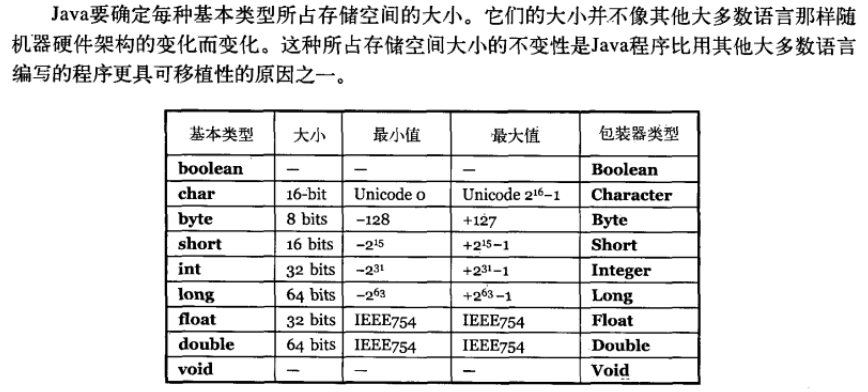

# Java基础知识

> https://github.com/Snailclimb/JavaGuide/blob/master/docs/java/Java基础知识.md

## 面向对象和面向过程的区别

### 面向过程

#### 优点

性能。因为类调用时需要实例化，开销比较大。

#### 缺点

不易维护、不易复用、不易拓展

### 面向对象

#### 优点

易维护、易复用、易拓展，由于面向对象有封装、继承、多态性的特性，可以设计出低耦合的系统，使系统更加灵活，更加易于维护

#### 缺点

性能。

## JVM JDK和JRE最详细通俗的解答

### JVM

Java虚拟机（JVM）是运行Java字节码的虚拟机。JVM有针对不同系统的特定实现，目的是使用相同的字节码，运行结果相同。

#### 什么是字节码？采用字节码的好处是什么？

在Java中，JVM可以理解的代码就叫做字节码（即拓展名为`.class`的文件），它不面向任何特定的处理器，只面向虚拟机。

Java程序从源代码到运行一般有下面三步：

JVM类加载器首先加载字节码文件，然后通过解释器逐行解释执行，这种方式的执行速度会相对比较慢。而且，有些方法和代码块是经常需要被调用的（也就是所谓的热点代码），所以后面引入了JIT编译器（运行时编译）。当JIT编译器完成第一次编译后，其会将字节码对应的机器码保存下来，下次可以直接使用。

> HotSpot采用惰性评估（Lazy Evalution）的做法，根据二八定律，消耗大部分系统资源的只有那一小部分的代码（热点代码），而这也就是JIT所需要编译的部分。JVM会根据代码每次被执行的情况收集信息并相应地做一些优化，因此执行的次数越多，它的速度就越快。JDK9引入了一种新的编译模式AOT（Ahead of Time Compilation），它是直接将字节码编译成机器码，这样就避免了JIT预热等各方面的开销。JDK支持分层编译和AOT协作使用。但是，AOT编译器的编译质量是肯定比不上JIT编译器的。

### JDK和JRE

JDK是Java Development Kit，它是功能齐全的Java SDK。它拥有JRE所拥有的一切，还有编译器（javac）和工具（如javadoc和jdb）。它能够创建和编译程序。

JRE 是 Java运行时环境。它是运行已编译 Java 程序所需的所有内容的集合，包括 Java虚拟机（JVM），Java类库，java命令和其他的一些基础构件。但是，它不能用于创建新程序。

如果你只是为了运行一下 Java 程序的话，那么你只需要安装 JRE 就可以了。如果你需要进行一些 Java 编程方面的工作，那么你就需要安装JDK了。但是，这不是绝对的。有时，即使您不打算在计算机上进行任何Java开发，仍然需要安装JDK。例如，如果要使用JSP部署Web应用程序，那么从技术上讲，您只是在应用程序服务器中运行Java程序。那你为什么需要JDK呢？因为应用程序服务器会将 JSP 转换为 Java servlet，并且需要使用 JDK 来编译 servlet。

## 字符型常量和字符串常量的区别？

1. 形式上：字符常量是单引号引起的一个字符；字符串常量是双引号引起的若干个字符
1. 含义上：字符常量相当于一个整形值，可以参加表达式运算；字符串常量代表一个地址值（该字符串在内存中存放位置）
1. 占内存大小：字符常量只占2个字节；字符串常量占若干个字节（至少一个字符结束标志）（char在Java中占两个字节）

## String StringBuffer和StringBuilder的区别是什么？String为什么是不可变的？

### 可变性

String类中使用final关键字修饰字符数组来保存字符串，private final char value[]，所以String对象是不可变的。而StringBuilder与StringBuffer都继承自AbstractBuilder类，在AbstractStringBuilder中也是使用字符数组保存字符串char [] value，但是没有用final关键字修饰，所以这两种对象都是可变的。

### 线程安全性以及性能

String中的对象不可变，线程安全。StringBuffer对公有方法加上了同步锁，而StringBuilder没有对方法加同步锁。（使用StringBuilder比使用StringBuffer的性能提高了10%~15%）

对于三者使用的总结：

1. 操作少量的数据: 适用String
1. 单线程操作字符串缓冲区下操作大量数据: 适用StringBuilder
1. 多线程操作字符串缓冲区下操作大量数据: 适用StringBuffer

## 对象引用和对象实体

对象实例在堆内存中，对象引用在栈内存中。

## == 与 equals

### ==

基本数据类型比较的是值，引用数据类型比较的是内存地址。

### equals

1. 类没有覆盖equals()方法。则通过equals()比较该类的两个对象时，等价于通过`==`比较这两个对象。
1. 类覆盖了equals()方法。根据具体的实现。

## hashCode与equals

### hashCode介绍

hashCode()的作用是获取哈希码，也称散列码（一个int整数）。这个哈希码的作用是确定该对象在哈希表中的索引位置。hashCode()定义在JDK的Object.java中，这就意味着Java中的任何类型都包含有hashCode()函数。（可以用来快速找到所需要的对象）。

### 为什么要有hashCode？

当对象被加入HashSet时，HashSet会先计算对象的HashCode值来判断对象加入的位置，同时也会与其他已经加入的对象的HashCode值做比较，如果没有相符的HashCode，HashSet会假设对象没有重复出现。这时会调用equals()方法来检查HashCode相等的对象是否真的相同。如果两者相同，HashSet就不会让其加入操作成功。如果不同的话，就会重新散列到其他位置。这样就大大的提高了执行速度。

### HashCode与equals的相关规定

1. 如果连个对象相等，则hashcode一定也是相同的
1. 如果两个对象相等，对两个对象调用equals方法都返回true
1. 两个对象都有相同的hashcode值，它们也不一定是相等的
1. 因此，equals方法被覆盖过，则hashCode方法也必须被覆盖
1. hashCode()的默认行为是对堆上的对象产生独特值。如果没有重写hashCode()，则该class的两个对象无论如何都不会相等（即使这两个对象指向相同的数据）

## final关键字

final关键字主要用在三个地方：变量、方法、类。

1. 对于一个final变量，如果是基本数据类型的变量，则其数值一旦在初始化之后便不能更改；如果是引用类型的变量，则在对其初始化之后便不能再让其指向另一个对象。
1. 当用final修饰一个类时，表明这个类不能被继承。final类中的所有成员方法都会被隐式地指定为final方法。
1. 使用final方法的原因有两个。第一个原因是把方法锁定，以防任何继承类修改它的含义；第二个原因是效率。在早期的Java实现版本中，会将final方法转为内嵌调用。但是如果方法过于庞大，可能看不到内嵌调用带来的任何性能提升（现在的Java版本已经不需要使用final方法进行这些优化了）。类中所有的private方法都隐式地指定为final。