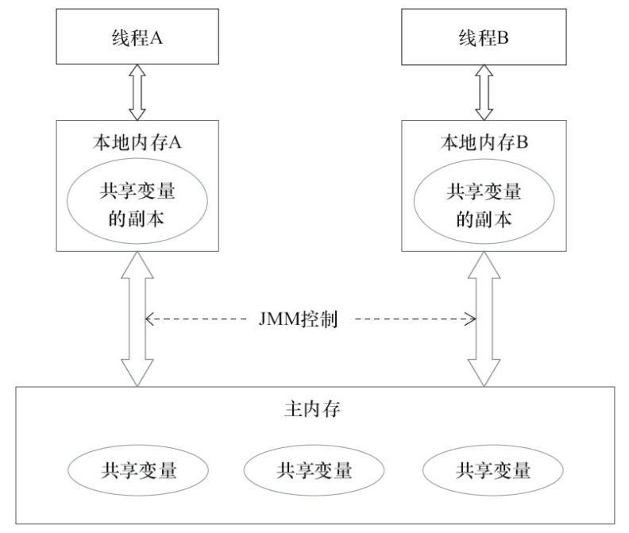
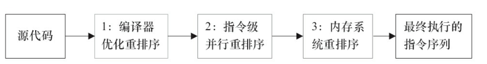
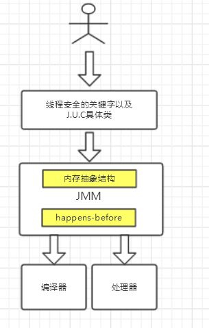

# Java内存模型以及happens-before规则

> 转载 https://www.jianshu.com/p/d52fea0d6ba5

## 引子

多线程操作很容易出现线程安全问题，在《深入理解Java虚拟机》中可以看到关于线程的定义：

当多个线程访问同一个对象时，如果不用考虑这些线程在运行时环境下的调度和交替运行，也不需要进行额外的同步，或者在调用方进行任何其他的协调操作，调用这个这个对象的行为都可以获取正确的结果，那这个对象是线程安全的。

而出现线程安全的问题一般是因为`主内存`和`工作内存数据`的`不一致性`和`重排序`导致的，而解决线程安全的问题最重要的是理解这两种问题是怎么来的，那么，理解它们的核心在于理解Java内存模型（JMM）。

在多线程条件下，多个线程肯定会相互协作完成一件事情，一般来说就会涉及到多个线程间相互通信告知彼此的状态以及当前的执行结果等，另外为了性能优化，还会涉及到编译器指令重排序和处理器指令重排序。

## 内存模型抽象结构

在并发编程中，主要需要解决两个问题：

1. 线程之间如何通信（通过何种机制交换信息，一般是共享内存和消息传递）
1. 线程之间如何完成同步

Java内存模型是共享内存的并发模型，线程之间主要通过读-写共享变量来完成隐式通信。

### 那些是共享变量

在Java程序中所有实例域，静态域和数组元素都是放在堆内存中（所有线程均可访问到，是可以共享的），而局部变量，方法定义参数和异常处理器参数不会在线程间共享。共享数据会出现线程安全的问题，而非共享数据不会出现线程安全的问题。

### JMM抽象结构模型

CPU的处理速度和主存的读写速度不是一个量级的，为了平衡这种巨大的差距，每个CPU都会有缓存。因此，共享变量会先放在主存中，每个线程都有输入自己的工作内存，并且会把位于主存中的共享变量拷贝到自己的工作内存，之后的读写操作均使用位于工作内存的变量副本，并在某个时刻将工作内存的变量副本写回到主存中去。JMM就从抽象层次定义了这种方式，并且JMM决定了一个线程对共享变量的写入何时对其他线程是可见的。

如图所示，线程A和线程B之间要完成通信的话，要经历如下两步：

1. 线程A从主内存中将共享变量读入线程A的工作内存后并进行操作，之后将数据重新写回到主内存中；
1. 线程B从主存中读取最新的共享变量

如果线程A更新数据后并没有及时写回到主存，而此时线程B读到的是过期的数据，这就出现了“脏读”的现象。

### 重排序

一个好的内存模型会放松对处理器和编译器规则的束缚，这就会使得软件技术和硬件技术都为同一个目标而进行奋斗：在不改变程序执行结果的前提下，尽可能提高并行度。

因此，在执行程序时，为了提高性能，编译器和处理器常常会对指令进行重排序。一般重排序分为如下三种：

1. 编译器优化的重排序。编译器在不改变单线程语义的前提下，可以重新安排语句的执行顺序
1. 指令级并行的重排序。现代处理器采用了指令级并行技术来将多条指令重叠执行。如果不存在数据依赖性，处理器可以改变语句对应机器指令的执行顺序
1. 内存系统的重排序。由于处理器使用缓存和读/写缓冲区，这使得加载和存储操作看上去可能是在乱序执行的。

如图，1属于编译器重排序，而2和3统称为处理器重排序。这些重排序会导致线程安全的问题。

针对编译器重排序，JMM的编译器重排序规则会禁止一些特定类型的编译器重排序；针对处理器重排序，编译器在生成指令序列的时候会通过插入内存屏障来禁止某些特殊的处理器重排序。

#### 重排序的定义

如果两个操作访问同一个变量，且这两个操作有一个为写操作，此时这两个操作就存在数据依赖性。这里存在三种情况：

1. 读后写
2. 写后写
3. 写后读

这三种操作都是存在数据依赖性的，如果重排序会对最终执行结果存在影响。编译器和处理器在重排序时，会遵守数据依赖性，编译器和处理器不会改变存在数据依赖关系的两个操作的执行顺序。

不过无论怎么重排序，程序的执行结果不能被改变。这就是`as-if-serial`，编译器、runtime和处理器都必须遵守as-if-serial语义。

as-if-serial语义把单线程程序保护了起来，遵守as-if-serial语义的编译器，runtime和处理器为编写单线程程序的程序员创建了一个幻觉：单线程程序是按照程序的顺序来执行的。（`as-if-serial`为了单线程）

### happens-before规则（为了多线程）

如果一会是编译器重排序，一会是处理器重排序，那么程序员必须要去理解这些底层的实现以及具体规则，这样的话程序员的负担就太重了，严重影响了并发编程的效率。因此，JMM为程序员在上层提供了六条规则，这样我们就可以根据规则去推论跨线程的内存可见性，而不用再去理解底层重排序的规则。

#### happens-before定义

happens-before的概念最初由Leslie Lamport在其一篇影响深远的论文（《Time，Clocks and the Ordering of Events in a Distributed System》）中提出，有兴趣的可以google一下。JSR-133使用happens-before的概念来指定两个操作之间的执行顺序。由于这两个操作可以在一个线程之内，也可以是在不同线程之间。因此，JMM可以通过happens-before关系向程序员提供跨线程的内存可见性保证（如果A线程的写操作a与B线程的读操作b之间存在happens-before关系，尽管a操作和b操作在不同的线程中执行，但JMM向程序员保证a操作将对b操作可见）。具体的定义为：

1. 如果一个操作happens-before另一个操作，那么第一个操作的执行结果将对第二个操作可见，而且第一个操作的执行顺序排在第二个操作之前。
1. 两个操作之间存在happens-before关系，并不意味着Java平台的具体实现必须要按照happens-before关系指定的顺序来执行。如果重排序之后的执行结果，与按happens-before关系来执行的结果一致，那么这种重排序并不非法（也就是说，JMM允许这种重排序）。

#### 具体规则

1. 程序顺序规则：一个线程中的每个操作，happens-before于该线程中的任意后续操作。
1. 监视器锁规则：对一个锁的解锁，happen-before于随后对这个锁的加锁。
1. volatile变量规则：对一个volatile域的写，happen-before于任意后续对这个volatile域的读。
1. 传递性：如果A happens-before B，且B happens-before C，那么A happen-before C。
1. start()规则：如果线程A执行操作ThreadB.start()（启动线程B），那么A线程的ThreadB.start()操作happens-before于线程B中的任意操作。
1. join()规则：如果线程A执行操作ThreadB.join()并成功返回，那么线程B中的任意操作happens-before于线程A从ThreadB.join()操作成功返回。
1. 程序中断规则：对线程interrupted()方法的调用先行于被中断线程的代码检测到中断时间的发生。
1. 对象finalize规则：一个对象的初始化完成（构造函数执行结束）先行于发生它的finalize()方法的开始。

### 总结

#### JMM的设计

JMM是语言级的内存模型，JMM包含了两个方面：

1. 内存模型
1. 重排序以及happens-before规则。同时为了禁止特定类型的重排序会对编译器和处理器指令序列加以控制。在上层有基于JMM的关键字和java.util.current包下的一些具体类用来方便程序员能够高效率的进行并发编程。

##### JMM的设计图

1. JMM向程序员提供的happens-before规则能满足程序员的需求。JMM的happens-before规则不但简单易懂，而且也向程序员提供了足够强的内存可见性保证（有些内存可见性保证其实并不一定真实存在，比如上面的A happens-before B）。
1. JMM对编译器和处理器的束缚已经尽可能少。从上面的分析可以看出，JMM其实是在遵循一个基本原则：只要不改变程序的执行结果（指的是单线程程序和正确同步的多线程程序），编译器和处理器怎么优化都行。例如，如果编译器经过细致的分析后，认定一个锁只会被单个线程访问，那么这个锁可以被消除。再如，如果编译器经过细致的分析后，认定一个volatile变量只会被单个线程访问，那么编译器可以把这个volatile变量当作一个普通变量来对待。这些优化既不会改变程序的执行结果，又能提高程序的执行效率。