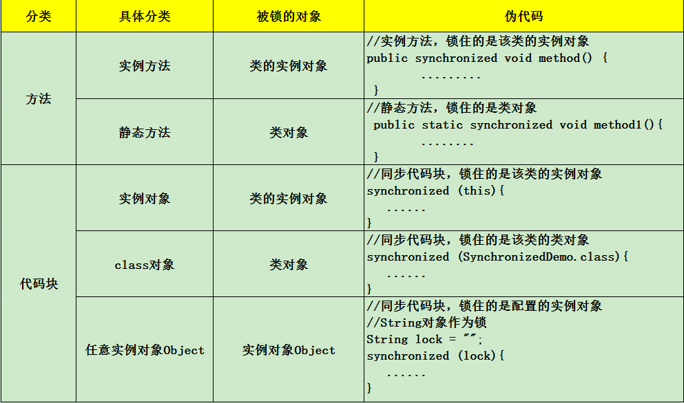
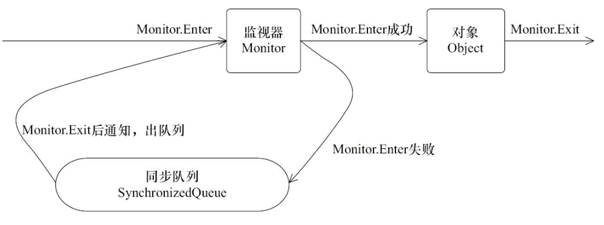

# synchronized关键字

> 转载至 https://www.jianshu.com/p/d53bf830fa09

## synchronized使用场景

## synchronized实现原理

### 对象锁（monitor）机制

> 例子见转载页面

任意一个对象都拥有自己的监视器，当这个对象由同步块或者这个对象的同步方法调用时，执行方法的线程必须先获取该对象的监视器才能进入同步块和同步方法，如果没有获取到监视器的线程将会被阻塞在同步块和同步方法的入口处，进入到BLOCKED状态。

### 锁的重入性

#### 可重入

若一个程序或子程序可以“在任意时刻被中断然后操作系统调度执行另外一段代码，这段代码又调用了该子程序不会出错”，则称其为可重入的。即当该子程序正在运行时，执行线程可以再次进入并执行它，仍然获得符合设计时预期的结果。与多线程并发执行的线程安全不同，可重入强调对单个线程执行时重新进入同一个子程序仍然是安全的。

#### 可重入的条件

1. 不在函数内使用静态或者全局数据。
1. 不返回静态或者全局数据，所有数据都由函数的调用者提供。
1. 使用本地数据（工作内存），或者通过制作全局数据的本地拷贝来保护全局数据。
1. 不调用不可重入函数。

#### 可重入与线程安全

一般而言，可重入的函数一定是线程安全的，反之则不一定成立，在不加锁的前提下，如果一个函数用到了全局或者静态变量，那么它不是线程安全的，也不是可重入的。如果我们加以改进，对全局变量的访问加锁，此时它是线程安全的但不是可重入的，因为通常的加锁方式是针对不同线程的访问，当同一个线程多次访问就会出现问题。只有当函数满足可重入的四重条件时，才是可重入的。

### synchronized的可重入性

#### synchronized是可重入锁

当一个线程请求一个由其他线程持有的对象锁时，该线程会阻塞。当线程请求自己持有的对象锁时，如果该线程是重入锁，请求就会成功，否则阻塞。

当一个线程请求一个由其他线程持有的对象锁时，该线程会阻塞。当线程请求自己持有的对象锁时，如果该线程是重入锁。因此，在一个线程中使用synchronized方法时调用该对象另一个synchronized方法，即一个线程得到一个对象锁后再次请求该对象锁，是永远可以拿到锁的。

在Java内部，同一个线程调用自己类中其他synchronized方法/块时不会阻碍该线程的执行，同一个线程对同一个对象锁是可重入的，同一个线程可以获取同一把锁多次，也就是可以多次重入。原因是Java中线程获得对象锁的操作是以线程为单位的，而不是以调用为单位的。

#### synchronized可重入锁实现

每个锁关联一个线程持有者和一个计数器。当计数器为0时表示该锁没有被任何线程持有，那么任何线程都可能获得该锁而调用相应方法。当一个线程请求成功后，JVM会记下持有锁的线程，并将计数器记为1。此时其他线程请求该锁，则必须等待。而该持有锁的线程如果再次请求这个锁，就必须等待。而持有该锁的线程如果再次请求这个锁，就可以再次拿到这个锁，同时计数器会递增。当线程退出一个synchronized方法/块时，计数器会递减，如果计数器为0则释放该锁。