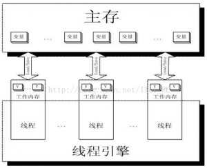

# volatile关键字

> 文章见`https://blog.csdn.net/yanshuanche3765/article/details/78405872`

提到这个关键字之前，一定要提到的就是CPU缓存

## CPU缓存

> CPU 缓存的出现主要是为了解决CPU运算速度与内存读写速度不匹配的矛盾，因为CPU运算速度要比内存读写速度快的多，例如：

1. 一次主内存的访问通常在几十到几百个时钟周期
1. 一次L1高速缓存的读写只需要1~2个时钟周期
1. 一次L2高速缓存的读写也只需要数十个时钟周期

基于此，现在CPU大多数情况下读写都不会直接访问内存（CPU都没有连接到内存的管脚），取而代之的是CPU缓存，即Cache。

单核情况下，当系统运行时，CPU执行计算的过程如下：

1. 程序以及数据被加载到主内存
1. 指令和数据被加载到CPU缓存
1. CPU执行指令，把结果写到高速缓存
1. 高速缓存中的数据写回主内存

多核情况下，当系统运行时，可能有下面这种情况：

1. 核0读取了一个字节，根据局部性原理，它相邻的字节同样被读入核0的缓存
1. 核3做了上面同样的工作，这样核0与核3的缓存拥有同样的数据
1. 核0修改了那个字节，被修改后，那个字节被写回核0的缓存，但是该信息并没有写回主存
1. 核3访问该字节，由于核0并未将数据写回主存，数据不同步

为了解决这个问题，CPU制造商制定了一个规则：当一个CPU修改缓存中的字节时，服务器中其他CPU会被通知，它们的缓存将视为无效。于是，在上面的情况下，核三发现自己的缓存中数据已无效，核0将立即把自己的数据写回主存，然后核3重新读取该数据。

> 缓存是分段的，一个段对应一块存储空间，我们称之为缓存行，它是CPU缓存中可分配的最小存储单元，大小32字节、64字节、128字节不等，这与CPU架构有关。当CPU看到一条读取内存的指令时，它会把内存地址传递给一级缓存，以及缓存会检查它是否有这个内存地址对应的缓存行，如果没有就把整个缓存段从内存（或更高一级的缓存）中加载进来。

### 缓存一致性协议

在有的CPU架构设计中，会采用锁总线的方式进行。当锁总线的信号发出时，来自其他处理器或总线代理的控制请求将会被阻塞。但这这种方式的效率极低，一次我们希望：使用多组缓存，但是它们的行为看上去只有一组缓存那样，这就是缓存一致性。

缓存一致性协议有多种，但是日常处理的大多数计算机设备都属于“嗅探”协议，它的基本思想是：

所有的内存传输都发生在一条共享的总线上，而所有的处理器都能看到这条总线：缓存本身是独立的，但是内存是共享资源，所有的内粗能访问都养经过仲裁（同一个指令周期中，只有一个CPU缓存可以读写内存）。

CPU缓存不仅仅在做内存传输的时候才与总线打交道，而是不停在嗅探总线上发生的数据交换，跟踪其他缓存在做什么。所以当一个缓存代表它所属的处理器去读写内存时，其他处理器都会得到通知，它们以此来使自己的缓存保持同步。只要某个处理器一写内存，其他处理器马上知道这块内存在它们的缓存段中已失效。

#### MESI协议

MESI协议是当前最主流的缓存一致性协议，在MESI协议中，每个缓存行有4个状态，可用2个bit表示，分别是I、S、M、E：

1. I表示`失效/未载入`
1. S表示`干净`
1. M表示`脏的缓存段`
1. E表示`独占式访问`（这个状态解决了“在我们开始修改某块内存之前，我们需要告诉其他处理器”这一问题：只有当缓存行处于E或M状态时，处理器才能去写它，也就是说只有在这两种状态下，处理器是独占这个缓存行的，当处理器想写某个缓存行时，如果它没有独占权，它必须先发送一条“我要独占权”的请求给总线，这会通知其他处理器把它们拥有的同一段缓存的拷贝失效（如果有）。只有在获得独占权后，处理器才能开始修改数据——并且此时这个处理器知道，这个缓存行只有一份拷贝，在我自己的缓存里，所以不会有任何冲突。）

#### Lock指令

Lock指令，就是为了实现数据一致性。在不同的CPU中，采取不同的方式，有的是锁总线，有的是锁缓存。

锁总线会导致其他CPU对内存的读写请求被阻塞，直到锁释放。

#### 从Lock指令回看volatile变量读写

线程的工作内存其实就是对CPU寄存器核高速缓存的抽象，或者说每个线程的工作内存也可以理解为CPU寄存器和高速缓存。

那么当写两条线程Thread-A与Thread-B同时操作主存中的一个volatile变量i时，Thread-A写了变量i，那么：

1. Thread-A发出LOCK#指令
1. 发出的LOCK#指令锁总线（或锁缓存行），同时让Thread-B高速缓存中的缓存行内容失效
1. Thread-A向主存回写最新修改的i

Thread-B读取变量i，那么：

1. Thread-B发现对应地址的缓存行被锁了，等待锁的释放，缓存一致性会保证它读取到最新的值

显而易见，volatile关键字的读和普通变量的读取相比基本没差别，差别主要还是在变量的写操作上。

#### volatile变量

## 可见性

> 在Java中用volatile关键字修饰某变量，Java编译器和线程不会缓存该变量，并总是从主存中读取该变量。

volatile关键字可以保证可见性和执行顺序

可见性即是先发生的原子修改操作一定会在读操作之前执行完成（同一时间对volatile变量只能有一个操作）

