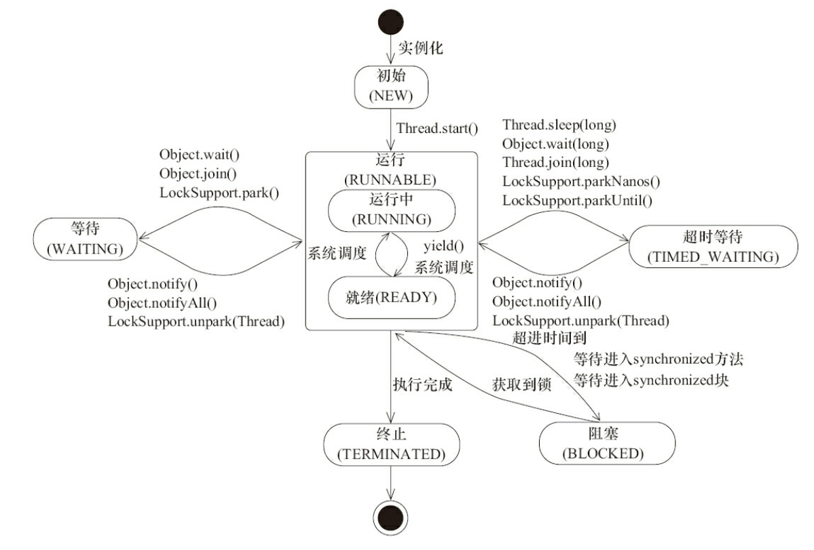
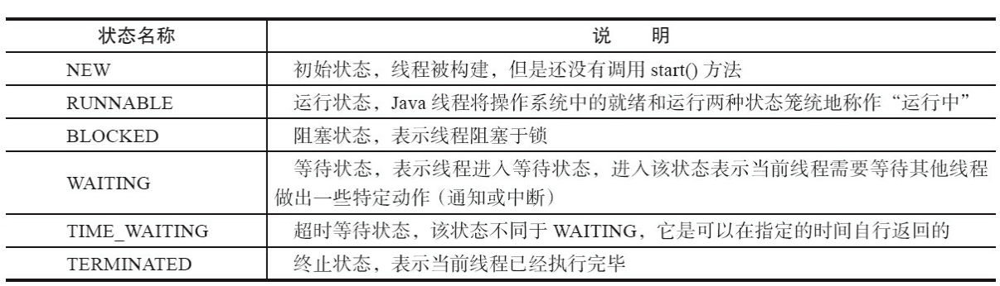

# 线程状态转换以及基本操作

> https://www.jianshu.com/p/f65ea68a4a7f

## 线程状态转化





## 线程状态的基本操作

### interrupted

> https://www.cnblogs.com/jiangzhaowei/p/7209949.html

Java中断机制是一种协作，也就是说通过中断并不能直接终止另一个线程，而需要被中断的线程自己处理中断。

#### 中断的处理

作为一种协作机制，不会要求被中断线程一定要在某个点进行处理。实际上，被中断线程只需要在合适的时候处理即可，如果没有合适的时间点，甚至可以不处理，这时候在任务处理层面，就跟没有调用中断方法一样。

中断可以理解为线程的一个标志位，它表示了一个运行中的线程是否被其他线程进行了中断操作。其他线程可以调用该线程的interrupt()方法对其进行中断操作，同时该线程可以调用isInterrupted()来感知其他线程对其自身的中断操作，从而做出响应。另外，同样可以调用Thread的静态方法interrupted()对当前线程进行中断操作，该方法会清除标志位。（需要注意的是，当抛出InterrputedException时候，会清楚中断标志位，也就是说在调用isinterrputed会返回false）。

一般在结束线程时通过中断标志位或者标志位的方式可以有机会去清理资源。

### join

Thread类中的join方法的主要作用就是同步，它可以使得线程之间的并行执行变为串行执行。（join方法只有在线程start之后才有效）

```Java

// 无参的join()方法被调用时，表示当前线程等待被调用线程执行完毕才继续执行。
join()
// 有参的join(long time)方法被调用时，表示当前线程会等待被调用线程time毫秒，然后执行顺序变成普通的并行执行
join(long time)

```

从源码中可以看到：

join方法的原理就是调用相应线程的wait方法进行等待操作的，例如A线程中调用了B线程的join方法，则相当于在A线程中调用了B线程的wait方法，当B线程执行完（或者到达等待时间），B线程会自动调用自身的notifyAll方法唤醒A线程，从而达到同步的目的。


### sleep

sleep()是Thread的静态方法，它是让当前线程按照指定的时间休眠，其休眠时间的精度取决于处理器的计时器和调度器。需要注意的是如果当前线程获得了锁，sleep方法并不会失去锁。

#### sleep()与wait()的区别

1. sleep()方法是Thread的静态方法，而wait是Object实例方法
1. wait()方法必须在同步方法或者同步块中调用，也就是必须已经获得对象锁。而sleep()方法没有这个限制可以在任何地方使用。另外wait()方法会释放占有的对象锁，使该线程进入等待池中，等待下一次获取资源。而sleep()方法只是会让出CPU并不会释放掉对象锁；
1. sleep()方法在休眠时间达到后如果再次获得CPU时间片就会继续执行，而wait()方法必须等待Object.notify/Object.notifyAll通知后，才会离开等待池，并且再次获得CPU时间片才会继续执行。

### yield

`public static native void yield();`这是一个静态方法，一旦执行，它会是当前线程让出CPU，但是，需要注意的是，让出的CPU并不代表当前线程不再运行了，如果在下一次竞争中，又获得了CPU时间片，当前线程依然会继续运行。另外，让出的时间片指挥分配给当前线程相同优先级的线程。

> yield和sleep都是当前线程交出处理器资源，而不同的是，sleep交出来的时间片其他线程都可以去竞争，也就是说都有机会获得当前线程让出的时间片。而yield方法只允许与当前线程具有相同优先级的线程能够获得释放出来的CPU时间片。

## 守护线程

守护线程是一种特殊的线程，一般在后台默默地守护一些系统服务，比如垃圾回收线程，JIT线程就可以理解为守护线程。线程可以通过setDaemon(true)的方法将线程设置为守护线程（设置守护线程要先于start()方法，否则会抛出IllegalThreadStateException，虽然线程还是会执行，但是只会被当作正常的用户线程执行）。需要注意的是守护线程在推出的时候并不会执行finally块中的代码，所以将释放资源等操作不要放在finally块中执行，这种操作是不安全的。